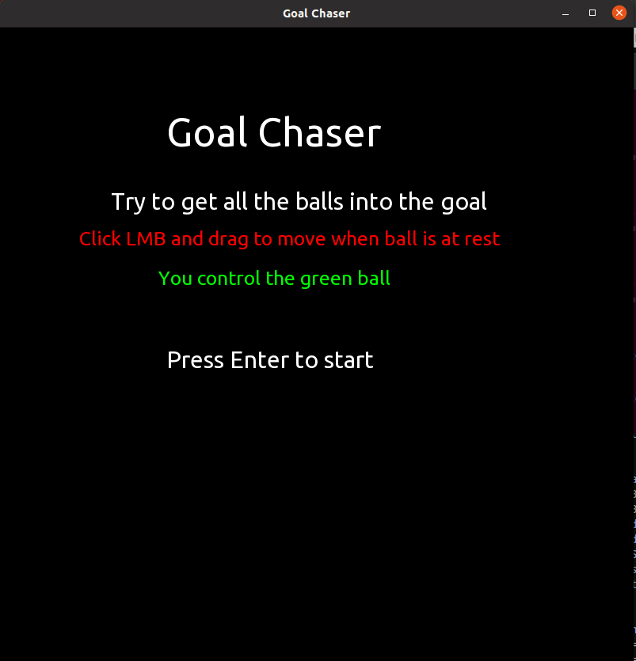
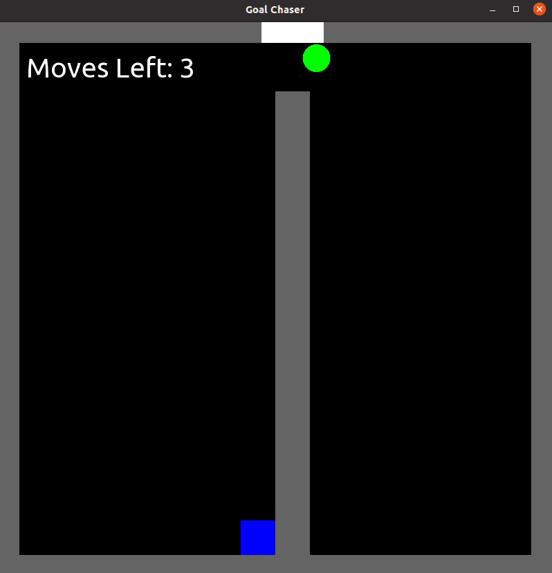
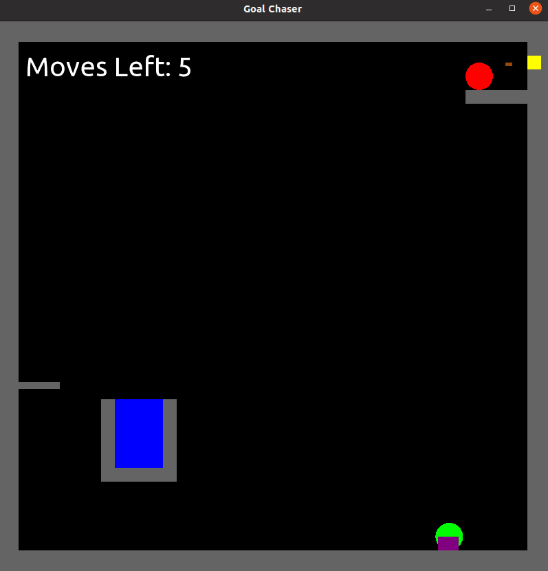
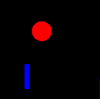
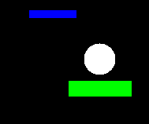
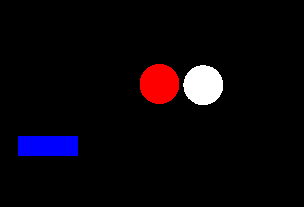
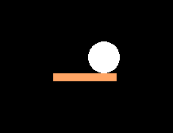

# COS 370 final logic game/game engine
requires SFML

Collider Structure - has variable options to pair a graphical shape with a collider structure
- int shape = what kind of shape it is (0=circle, 1=rectangle)
- float x = x position
- float y = y poisiton
- float radius = radius or width
- float radius2 = height
- bool isStatic = whether the object is able to move or not
- bool tempStatic = whether the object is moving or not
- bool            = whether the object can be removed or not
- float velocity_y = velocity in the y direction
- float velocity_x = velocity in the x direction
- float acceleration_y = acceleration in the y direction
- float acceleration_x = acceleration in the x direction
- float mass = how much gravity effects the collider
- string material = how much force the collider gives off (can be "hard", "soft", "sticky", "rubber", "plastic", "metal")

void do_collisions(Collider *colliders[], int size) - pass a pointer to an array of colliders and it's size, checks all colliders against each other using collision((Collider *obj1,Collider *obj2) function.

float mid(float a, float b, float c) - takes three floats as arguments, returns the middle value between three floats

float material_velocity_y(Collider *c) - takes a pointer to a collider and returns a percentage of the y velocity a collider should retain after a collision (handles "rubber", "plastic", and "metal")

float material_velocity_x(Collider *c) - takes a pointer to a collider and returns a percentage of the y velocity a collider should retain after a collision (handles "rubber", "plastic", and "metal")

float static_absorb(Collider *c) - takes a pointer to a collider and returns an "absorb" value that will be used to reduce the veloicty of a collider after colliding with it. (handles "hard", "soft", "sticky")

void collisions(Collider *c1, Collider *c2) - applies force to the colliding objects

bool collision(Collider *obj1,Collider *obj2) - true or false statement on if the collider has collided with something

void velocityUpdate(Collider *c1, float DT) - updates the velocity of the called collider

void velocity_cutoff(Collider *c1) - determines when a collider's should stop moving 

setPostion(collider.x,collider.y) - is required to change positions after all physics calls.

# Geometry Crash
- Connor White

Geometry Crash is a physics puzzle game with two levels currently.
To play level 1 press ENTER, to play level 2 press the RIGHT ARROWS.

The objective of the game is to get your green ball to smash the 3 orange balls on each level, with the help of other walls falling on top of the orange balls.

The game is simple, the greenball will rotate up and down, pressing SPACE launches the ball, if the ball gets stuck, press E to reclaim it.

The player only has 5 tries per level, good luck!

# Goal Chaser
- Ryan Costello

Goal Chaser is a physics puzzle game with four levels.

The objective of the game is to get the green ball, along with any red balls that may be in the level, into the blue goal. This is accomplished by dragging the mouse to apply a force to the ball to make it collide with the other objects in the level. You only have a limited number of moves per level, so you have to be logical in your playstyle.

There are different kind of materials that make up the platforms in the game, each of them altering the resulting velocities of objects in motion differently. The player has to think about how to line up the next move by considering how the level has been laid out, and what each part of the level is made up of. 

This is the title screen of the game.

In this screenshot we can see how the web material on that middle rectangle to get the ball to stick to the ceiling.

In this shot, we see an arrow about to hit the red ball. This was activated by the green ball hitting the purple switch at the bottom of the screen.

# Falling Physics
Falling Physics is a physics puzzle game with 2 levels.
Choose a level by clicking on the buttons on the Main Menu

The objective of the game is to get the white ball to hit the orange platform. The only way to do this is to utilize blue walls and platforms, and/or the other balls in the game. The game is fairly simple to understand - just click on any blue objects that you want to remove from the screen - but the puzzles themselves are challenging.

This game uses the physicsEngine that our team created this semester. I added one variable option to the Collider struct called 'canDisappear'.  Setting this value to true or false determines whether or not an object can be removed from the game. Some examples of how the engine is used is documented in the images below:

In this image, the ball is being affected by gravity and has an x and y velocity associated with it, so it falls at an increasing rate until it collides with another object.

In this image, the white ball has collided with the green platform, which has a "hard" material.  This results in the ball retaining most of it's momentum, but bouncing and changing directions appropriately. (see physicsEngine.cpp collides()  and static_absorb())

In this image, the balls have collided, changing the directions of both balls according to the angle at which they collided with each other. (see physicsEngine.cpp collides())

In this image, the white ball has collided with the orange platform. The orange platform has a "sticky" material. This results in causing the ball to lose all velocity and acceleration, as if the ball has stuck to the platform (see physicsEngine.cpp static_absorb())

A final note about a feature (not a bug..). The reset button can only be pushed once.  Pushing it twice will result in a segmentation fault. To play the game consistently, you must fail and return to the home screen before playing the level again.  

Good luck!
